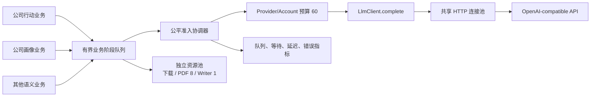

# 公共 LLM 全局资源协调与异步流水线基础模块需求

## 1. 文档定位

本文定义 Quote 项目中所有 LLM 批处理业务共同使用的资源协调和异步执行基础能力。
它是现有公共 LLM 网关之上的执行层，解决多业务、多 profile、大批量请求同时运行时的：

- 全局并发预算；
- 排队、公平调度和背压；
- HTTP 连接生命周期；
- 异步阶段协作；
- 取消、超时、重试和恢复；
- 统一运行指标。

本文不定义任何公告、公司行动、公司画像、供应链、财务字段或投资业务语义。

相关文档：

```text
docs/development/common_llm_gateway_requirements.md
docs/development/common_llm_gateway_architecture.md
docs/development/official_announcement_acquisition.md
docs/development/cninfo_corporate_action_async_pipeline_requirements.md
```

对应 OpenSpec change：

```text
openspec/changes/establish-common-llm-work-orchestration/
```

## 2. 边界结论

### 2.1 应放在 `utils/llm` 的能力

- provider/account 全局并发协调；
- profile 并发和 RPM 限制的组合治理；
- 有界队列、背压和公平准入；
- 通用 work item、stage outcome 和资源租约；
- LLM、文档下载、CPU 解析、串行写入等资源池抽象；
- HTTP client、连接池、启动和关闭生命周期；
- 共享 cooldown、deadline、取消和带 jitter 的退避；
- 请求身份、哈希、阶段指标和脱敏日志；
- 使用 fake transport/fake clock 的离线测试工具。

建议目录边界：

```text
utils/llm/
  client.py
  models.py
  transport.py
  rate_limit.py
  orchestration/
    models.py
    coordinator.py
    queues.py
    stages.py
    lifecycle.py
    metrics.py
```

目录名称可以结合现有代码调整，但职责边界不能改变。

### 2.2 不应放在 `utils/llm` 的能力

- CNInfo、交易所公告查询和来源路由；
- 公告附件可信 URL、下载审计和来源身份归一化；
- PDF 归档、页级文本、OCR 触发条件；
- 公告标题是否与分红送配相关；
- 提示词、业务 JSON Schema 和业务字段解释；
- 分红、送转、配股、除权日、复牌日等公司行动规则；
- 证据是否足够、是否自动确认、是否进入人工审核；
- 业务数据库事务和生产事实写入。

官方公告查询和附件获取继续归属：

```text
research/announcements/
```

各业务只消费统一公告接口，不把公告模块搬入 `utils/llm`。

## 3. 建设原因

现有 `LlmClient.complete()` 已能处理单次结构化请求，但批量业务仍各自实现循环、并发和
连接管理，存在以下问题：

1. 模型一次响应可达 2 至 5 分钟，串行流程大量时间处于空等；
2. 标题、正文抽取、语义复核可能分别配置 50 并发，合计突破供应商限制；
3. 不同业务同时运行时，profile 内部 semaphore 无法控制整个账号；
4. PDF 解析、LLM 请求和 SQLite 写入的资源性质不同，不能共用同一并发数；
5. 部分任务创建的 `LlmClient` 没有稳定的显式关闭路径；
6. 重试退避缺少 jitter，多请求同时失败时可能再次同时冲击上游；
7. 各业务重复实现队列、日志、断点和结果匹配，容易出现身份串线。

## 4. 本机容量评估与默认值

当前主机基线：

- 16 CPU 核；
- 31 GiB 内存，评估时约 27 GiB 可用；
- 单进程文件描述符上限 1024；
- HTTPX 默认活动连接上限 100；
- 50 个模拟 LLM 请求同时在途时，约 208 MiB 最大 RSS；
- 单个 166 KiB、5 页 PDF 原生文本解析约 1.4 秒，Python 峰值分配约 6.8 MiB。

结论：本机能够支撑 50 个主要处于网络等待状态的 LLM 请求，但不能据此把 PDF/OCR、
数据库写入或所有网络来源也设置为 50。

初始资源预算：

| 资源 | 默认值 | 硬约束/说明 |
|---|---:|---|
| provider/account LLM 并发 | 60 | 已确认的账号最高并发，不得配置更高 |
| 批量 LLM 配置上限 | 50 | 预留 10 路给短任务、健康检查和运维；业务默认值可更低 |
| PDF/OCR 解析 | 8 | CPU、内存独立约束 |
| SQLite writer | 1 | SQLite 单写者，允许有界批量提交 |
| 文档下载 | 独立配置 | 必须服从来源限速，不跟随 LLM 并发 |

## 5. 总体架构



公共模块提供积木，业务模块决定怎样拼装阶段。公共模块不能内置“标题分类后下载 PDF”这类
公司公告专用流程。

## 6. 全局并发治理

### 6.1 Provider/account 资源键

每个 profile 必须映射到稳定的 provider/account 资源键。相同 API 账号的 profile 必须共享
同一资源键，即使模型、提示词或业务不同。

一次调用按以下顺序受控：

1. 进入 workload 有界等待队列；
2. 通过 provider/account 公平准入；
3. 获取 provider/account 并发租约；
4. 获取 profile 并发/RPM 许可；
5. 执行 HTTP 请求和有限重试；
6. 无论成功、失败、取消或 deadline 到期都释放租约。

直接调用 `LlmClient.complete()` 也必须走同一协调器，不能存在业务绕过入口。

### 6.2 进程范围和部署约束

首版“全局”指应用进程内所有 client、profile 和业务共享。它不承诺跨多台机器、多个独立
进程的分布式限流。

在没有外部分布式协调器前，生产必须保持：

- 同一 provider 账号只运行一个 scheduler/批处理执行进程；
- 不允许两个独立应用进程各自按 60 并发运行；
- 临时手工任务也必须进入同一应用任务执行器。

未来如果必须多进程部署，应另行设计 Redis、数据库租约或外部限流服务，不能假设当前内存
协调器自动生效。

### 6.3 智能拥塞控制

provider/account 的有效批量并发不是固定值。公共协调器必须依据真实 provider 结果动态调整，
但不得把同一波相关故障当成多次独立容量结论。

控制规则：

- 429 是硬限流信号，立即按硬降档比例处理并服从 `Retry-After`；
- 408、502/503/其他可重试 5xx、DNS、timeout 和 transport error 是软信号；
- 单个软故障只进入有界滑动窗口，不立即降低全局并发；
- 软故障数量和错误率同时达到阈值后，才触发一次温和降档；
- 同一故障合并窗口内的其他失败只累计 raw/coalesced 指标，不重复降档；
- 软故障事件内出现 429 时升级为硬事件，硬目标按事件开始前的并发计算，不重复叠乘；
- provider 全局 cooldown 使用原始 `Retry-After`，单请求退避仍受 profile 上限和 deadline 约束；
- JSON 解析和 schema repair 失败不属于 provider 容量故障，不得改变全局并发；
- 降档后必须等待 cooldown、无故障静默期和足够成功请求，再进行恢复探测；
- 恢复按比例增长并设置探测间隔，例如 `6 -> 8 -> 11 -> 15`，不得长期每次只恢复一路；
- 新的拥塞事件会中断恢复并重新计算静默期。

账号宣称的 60 并发是硬上限，不等于任意 token 负载都能稳定维持 60。有效并发表示协调器
当前的准入状态，不得解释为 provider 已测得的永久容量。

## 7. 公平调度和背压

### 7.1 Workload 公平性

协调器按 workload 建立有界等待队列，默认权重为 1，采用可测试的轮转或加权轮转准入。

目标：

- 历史全量回补不能长期阻塞日更或短任务；
- 标题分类不能长期挤压正文抽取和语义复核；
- 业务不能私自绕开队列占满 60 路；
- 队列中的取消和过期请求不占用实际并发。

不允许业务提交任意调度函数，以免公共层变成不可验证的插件系统。业务只提供 workload 名称、
有限权重和任务优先级类别。

### 7.2 有界队列

每个阶段必须配置最大队列长度。下游已满时，上游等待或按明确策略停止生产，不允许无限累计。

队列传递：

- 业务 item ID；
- artifact/page/section 引用；
- 输入和版本哈希；
- 小型结构化结果；
- 错误和重试分类。

队列不应长期保存：

- 大量 PDF bytes；
- 完整长公告正文的多份副本；
- 完整 prompt/response 的日志副本；
- 打开的数据库事务或网络 response stream。

## 8. 公共阶段执行契约

### 8.1 WorkItem

通用 work item 至少包括：

| 字段 | 含义 |
|---|---|
| `work_id` | 公共不可变工作 ID |
| `workload` | 业务工作负载名称 |
| `run_id` | 本次任务运行 ID |
| `business_item_key` | 业务主键，由调用方解释 |
| `stage` | 当前阶段名称 |
| `stage_sequence` | 阶段序号/版本 |
| `attempt` | 当前阶段尝试次数 |
| `idempotency_key` | 幂等键 |
| `payload_ref` | 业务对象或 artifact 引用 |
| `metadata` | 不进入 prompt 的追踪信息 |

公共模块不得解析 `business_item_key` 和 `payload_ref` 的业务含义。

### 8.2 StageOutcome

统一结果分类：

```text
success
skipped_idempotent
retryable_failure
terminal_failure
cancelled
deadline_exceeded
```

结果必须保留原 work identity、阶段耗时、等待耗时、资源使用、错误分类和下游路由信息。

### 8.3 StageRunner

StageRunner 负责：

- 从有界输入队列读取；
- 获取本阶段需要的资源租约；
- 调用业务 callback；
- 标准化结果和异常；
- 释放租约；
- 将结果送入指定下游或问题队列；
- 维护阶段指标和关闭状态。

它不负责自动理解业务重试条件和数据库事务。

## 9. 独立资源池

不同资源必须分开治理：

| 资源池 | 典型操作 | 原则 |
|---|---|---|
| `llm_provider` | 标题分类、正文抽取、验证 | 全局共享 60，批量默认 50 |
| `document_download` | 官方附件下载 | 服从来源限流和连接策略 |
| `document_parse` | PDF、OCR | 最多 8 |
| `persistence` | SQLite 写入 | 默认 1 writer |

阶段不能持有一种资源等待另一种无关资源。例如：

- 下载完成后释放下载租约，再排队解析；
- PDF 解析完成后释放 CPU 租约，再排队 LLM；
- LLM 返回后释放 provider 租约，再进行确定性校验和写库；
- writer 不能在事务中等待网络或模型。

## 10. HTTP client 和生命周期

支持两种所有权：

1. 应用所有：应用启动时建立，关闭时统一 `close()`；
2. 任务所有：任务通过 async context manager 建立，任务结束后关闭。

构造 `LlmClient` 时由调用方注入的 transport 默认仍由注入方所有；只有明确传入
`owns_transport=true` 时，client 才在关闭时一并关闭该 transport。client 自行创建的 HTTP
transport 始终由 client 所有。

要求：

- `close()` 幂等；
- 关闭时先停止新准入，再处理在途和排队任务；
- 连接池活动上限不得小于 client 实际允许并发；
- 连接池总量必须有界并为 provider 限额保留少量连接余量；
- 重复运行手工任务不能持续增加 socket 和文件描述符；
- 取消、异常和应用重启都必须进入关闭流程。

## 11. 重试、cooldown 和 deadline

公共网关继续负责：

- 网络、DNS、连接和读取超时；
- HTTP 408、429；
- 明确可重试的 5xx；
- 有界 JSON/schema repair。

退避要求：

- 指数退避加入有界随机 jitter；
- 尊重合法 `Retry-After`；
- 多次 429/5xx 可触发 provider/account 共享 cooldown；
- 同账号其他 profile 也必须服从共享 cooldown；
- 首次 cooldown、排队和限流受独立 `queue_timeout_seconds` 约束，不消耗 provider 执行预算；
- 首次准入后，HTTP、解析、退避和后续重试准入全部计入执行 deadline；
- 队列或执行 deadline 不足时直接失败，不再发起一次注定超时的请求；
- scheduler 和业务流水线继续提供更外层的整项任务 deadline，避免排队与执行预算分离后任务无限存活。

业务阶段可以重试自身的下载、解析或写库失败，但不能在外层无限重试 `complete()`。

## 12. 身份、幂等和乱序安全

50 个请求并发后，返回顺序必然与提交顺序不同。任何业务不得依赖“当前循环中的股票”。

LLM 结果至少关联：

- workload、run、business item、stage；
- 本地 request ID；
- provider request ID（上游提供时）；
- request hash、normalized input hash；
- schema/prompt 版本；
- idempotency key；
- attempt 和错误 lineage。

业务写入前必须再次验证身份。恢复任务遇到相同终态和相同输入哈希时应幂等跳过；输入、schema、
prompt 或 artifact 变化时必须重新处理。

## 13. 可观测性

至少提供以下聚合指标：

- provider/account 当前活动数和等待数；
- workload/stage 队列深度、最老等待时间；
- 准入等待、请求执行、重试和总耗时；
- 429、5xx、timeout、schema failure、cancel；
- cooldown 状态和剩余时间；
- 配置并发、有效并发、拥塞事件和恢复探测；
- 原始可重试失败、合并失败、滑动窗口错误率和最后失败类型；
- 下载、解析、writer 活动数和积压；
- 成功、失败、跳过、恢复和剩余数量。

日志和报告不能包含 API Key、Authorization、Cookie、完整敏感 prompt/response。使用 ID、hash、
错误类别和经过控制的摘要进行关联。

Telegram 只发送批次汇总。大量单条详情必须进入查询接口、数据库审计或分段问题消息。

## 14. 配置建议

配置结构可结合现有 `config/11_llm.json` 落地，至少表达：

```json
{
  "llm": {
    "provider_resources": {
      "primary_account": {
        "provider": "openai_compatible",
        "hard_max_concurrency": 60,
        "default_bulk_concurrency": 50,
        "reserved_concurrency": 10,
        "http_max_connections": 70,
        "http_max_keepalive_connections": 60,
        "requests_per_minute": 58,
        "adaptive_concurrency_enabled": true,
        "adaptive_min_bulk_concurrency": 5,
        "adaptive_recovery_successes": 6,
        "adaptive_failure_coalescing_seconds": 10.0,
        "adaptive_outcome_window_size": 30,
        "adaptive_soft_failure_min_count": 2,
        "adaptive_soft_failure_rate_threshold": 0.08,
        "adaptive_soft_decrease_ratio": 0.8,
        "adaptive_hard_decrease_ratio": 0.5,
        "adaptive_recovery_quiet_seconds": 30.0,
        "adaptive_recovery_probe_interval_seconds": 30.0,
        "adaptive_recovery_growth_factor": 1.3333333333333333,
        "rate_limit_cooldown_seconds": 10.0,
        "transient_cooldown_seconds": 2.0
      }
    },
    "orchestration": {
      "enabled": true,
      "default_queue_size": 200,
      "document_parse_concurrency": 8,
      "sqlite_writer_concurrency": 1,
      "progress_interval_seconds": 30
    }
  }
}
```

`requests_per_minute` 是 provider quota bucket 的滚动一分钟硬上限，与并发上限独立。所有引用该资源的业务 workload、profile、重试和 repair 共享同一计数器。profile 或业务请求可以配置更低值，但不能突破 provider 上限。快照应同时报告窗口已用额度、RPM 等待数量、下一次可准入时间和累计 RPM 等待时间。

字段名称以最终配置模型为准，但必须 fail closed 校验：

- hard max 不超过 60；
- bulk 不超过 hard max；
- reserved 与 bulk 关系合理；
- HTTP pool 能容纳实际 client 并发；
- 429 必须立即触发硬降档；软传输失败必须经过滑动窗口阈值和故障窗口合并；
- 恢复增长因子必须大于 1，降档比例必须在 0 和 1 之间；
- 队列和 worker 均为有界正整数；
- profile 必须映射到已声明的 provider resource。

## 15. 测试和验收

离线测试必须覆盖：

- 两个 profile 合计不超过 provider 上限；
- 大任务和短任务都能推进；
- 取消、deadline 和异常不泄漏租约；
- 429 共享 cooldown；
- 同一秒的多个软故障只形成一个拥塞事件；
- 单个软故障不降低全局并发；
- 软故障达到数量和错误率阈值后只温和降档一次；
- 稳定成功后按 `6 -> 8 -> 11 -> 15` 比例恢复，故障可中断恢复；
- jitter 不导致不可测试，使用 fake clock/random；
- 队列满时背压生效；
- 乱序返回不串 item；
- 重复 resume 幂等；
- 多次任务运行 client/socket 不泄漏；
- 关闭时已提交结果保留、未提交任务可恢复；
- 日志和指标脱敏。

真实环境分级验证：

1. 10 并发；
2. 25 并发；
3. 50 并发。

每级记录：成功率、429/5xx、超时、首字和总耗时、内存、文件描述符、连接数、身份正确性、
关闭耗时。上一级不通过，不进入下一级。

离线基准记录见：

```text
docs/development/common_llm_work_orchestration_benchmark.md
```

## 16. 实施顺序

1. 配置和公共数据模型；
2. provider/account 协调器；
3. 有界队列和 StageRunner；
4. 生命周期、连接池、cooldown 和指标；
5. 将现有 `LlmClient.complete()` 接入共享协调器；
6. 以 CNInfo 公司行动作为首个完整迁移业务；
7. 稳定后再迁移公司画像、供应链拆解等其他 LLM 批处理业务。

首个业务成功前保留原直接调用路径作为受控回滚，不允许一次性同时重写所有 LLM 业务。
