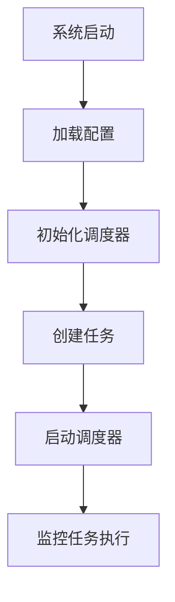
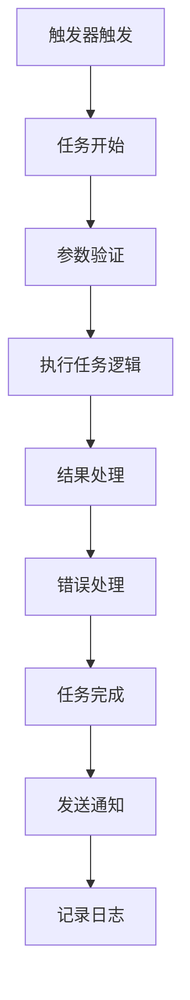

# 调度系统功能

## 📖 概述

调度系统是 Quote System 的核心组件之一，负责自动化执行各种定时任务。系统基于 APScheduler 构建，支持多种触发器和灵活的任务配置，能够自动完成数据更新、维护和监控等工作。

## 🎯 核心功能

### 1. 任务调度
- **定时执行**：支持 cron 表达式和间隔触发
- **任务管理**：动态添加、删除、修改任务
- **并发控制**：控制任务并发执行
- **错误处理**：任务失败重试和报警

### 2. 预定义任务
- **每日数据更新**：自动更新股票日线数据
- **系统健康检查**：检查数据源/数据库/资源状态，异常时告警
- **交易日历更新**：定期更新交易日历
- **数据维护**：每周数据备份和清理
- **月度缺口检查**：按范围检测并修复缺口
- **数据缺口检测与修复**：检测缺口并触发自动补齐
- **数据库备份**：定期备份数据库文件

### 3. 任务监控
- **状态监控**：实时查看任务执行状态
- **执行日志**：详细的任务执行记录
- **性能统计**：任务执行时间和成功率统计

## 🏗️ 系统架构

### 核心组件
```
SchedulerCore
├── TaskManager      # 任务管理器
├── JobConfig        # 任务配置
├── Monitor          # 监控组件
└── ErrorHandler    # 错误处理器
```

### 数据流
```
配置文件 → 任务调度器 → 任务执行 → 结果反馈 → 通知系统
```

## 📋 预定义任务详解

### 1. 每日数据更新 (daily_data_update)

#### 功能描述
自动下载和更新当日股票数据，确保数据的及时性。

#### 配置示例
```json
{
  "daily_data_update": {
    "enabled": true,
    "description": "每日数据更新",
    "trigger": {
      "type": "cron",
      "hour": 20,
      "minute": 30,
      "second": 0
    },
    "max_instances": 1,
    "misfire_grace_time": 600,
    "coalesce": true,
    "parameters": {
      "exchanges": ["SSE", "SZSE"],
      "wait_for_market_close": true,
      "market_close_delay_minutes": 15,
      "enable_trading_day_check": true
    }
  }
}
```

#### 业务逻辑
1. **交易日检查**：检查当日是否为交易日
2. **市场等待**：等待市场收盘后开始更新
3. **数据下载**：下载当日所有股票数据
4. **质量验证**：验证数据完整性
5. **结果通知**：发送更新结果通知

#### 核心方法
```python
async def daily_data_update(self,
                            exchanges: List[str] = None,
                            wait_for_market_close: bool = True,
                            market_close_delay_minutes: int = 15,
                            enable_trading_day_check: bool = True):
    """每日数据更新任务"""
```

### 2. 交易日历更新 (trading_calendar_update)

#### 功能描述
定期从数据源获取最新的交易日历信息，确保交易日的准确性。

#### 配置示例
```json
{
  "trading_calendar_update": {
    "enabled": true,
    "description": "交易日历更新",
    "trigger": {
      "type": "cron",
      "day": 1,
      "hour": 1,
      "minute": 0,
      "second": 0
    },
    "max_instances": 1,
    "misfire_grace_time": 1800,
    "coalesce": true,
    "parameters": {
      "exchanges": ["SSE", "SZSE"],
      "update_future_months": 6,
      "force_update": false,
      "validate_holidays": true
    }
  }
}
```

#### 业务逻辑
1. **数据源连接**：连接到数据源
2. **日期范围计算**：计算需要更新的日期范围
3. **交易日历获取**：从数据源获取交易日历
4. **数据验证**：验证交易日历的完整性
5. **数据库更新**：更新本地交易日历表

#### 核心方法
```python
async def trading_calendar_update(self,
                                exchanges: List[str] = None,
                                update_future_months: int = 6,
                                force_update: bool = False,
                                validate_holidays: bool = True):
    """交易日历更新任务"""
```

### 3. 每周数据维护 (weekly_data_maintenance)

#### 功能描述
执行定期的数据维护任务，包括备份、清理和优化。

#### 配置示例
```json
{
  "weekly_data_maintenance": {
    "enabled": true,
    "description": "每周数据维护",
    "trigger": {
      "type": "cron",
      "day_of_week": "sun",
      "hour": 2,
      "minute": 0,
      "second": 0
    },
    "max_instances": 1,
    "misfire_grace_time": 1800,
    "coalesce": true,
    "parameters": {
      "backup_database": true,
      "cleanup_old_logs": true,
      "log_retention_days": 30,
      "optimize_database": true,
      "validate_data_integrity": true
    }
  }
}
```

#### 维护任务
1. **数据库备份**：自动备份数据库
2. **日志清理**：清理过期日志文件
3. **数据库优化**：执行 VACUUM 和 ANALYZE
4. **数据完整性检查**：验证数据一致性
5. **性能优化**：优化数据库索引

#### 核心方法
```python
async def weekly_data_maintenance(self,
                                backup_database: bool = True,
                                cleanup_old_logs: bool = True,
                                log_retention_days: int = 30,
                                optimize_database: bool = True,
                                validate_data_integrity: bool = True):
    """每周数据维护任务"""
```

### 4. 月度数据完整性检查 (monthly_data_integrity_check)

#### 功能描述
每月执行数据完整性检查并修复缺口（可配置检查范围与过滤条件）。

#### 配置示例
```json
{
  "monthly_data_integrity_check": {
    "enabled": true,
    "description": "月度数据完整性检查和缺口修复",
    "trigger": {
      "type": "cron",
      "day": 1,
      "hour": 3,
      "minute": 0,
      "second": 0
    },
    "max_instances": 1,
    "misfire_grace_time": 3600,
    "coalesce": true,
    "parameters": {
      "exchanges": ["SSE", "SZSE"],
      "days_to_check": 45
    }
  }
}
```

### 5. 季度数据清理 (quarterly_cleanup)

#### 功能描述
每季度执行一次深度清理，删除过期数据。

#### 配置示例
```json
{
  "quarterly_cleanup": {
    "enabled": true,
    "description": "季度数据清理",
    "trigger": {
      "type": "cron",
      "month": "3,6,9,12",
      "day": "last",
      "hour": 4,
      "minute": 0,
      "second": 0
    },
    "max_instances": 1,
    "misfire_grace_time": 1800,
    "coalesce": true,
    "parameters": {
      "cleanup_old_quotes": true,
      "quote_retention_months": 36,
      "cleanup_temp_files": true,
      "cleanup_backup_files": false,
      "backup_retention_months": 12
    }
  }
}
```

### 6. 数据缺口检测与修复 (find_gap_and_repair)

#### 功能描述
定期检测交易品种的数据缺口，并根据配置参数触发自动修复。

#### 配置示例
```json
{
  "find_gap_and_repair": {
    "enabled": true,
    "description": "数据缺口检测与修复",
    "trigger": {
      "type": "cron",
      "day_of_week": "sun",
      "hour": 3,
      "minute": 30
    },
    "max_instances": 1,
    "misfire_grace_time": 1800,
    "coalesce": true,
    "parameters": {
      "exchanges": ["SSE", "SZSE", "BSE"],
      "start_date": "2024-01-01"
    }
  }
}
```

#### 业务逻辑
1. **缺口检测**：按交易所与日期范围检测缺口
2. **自动修复**：逐个缺口触发补齐
3. **执行记录**：记录检测数量与修复结果

### 7. 系统健康检查 (system_health_check)

#### 功能描述
定期检查系统健康状态，包括数据源、数据库、磁盘与内存使用情况。

#### 说明
- 当检测到 `baostock_a_stock` 异常时，会尝试自动重连修复
- 修复结果会通过 Telegram 通知，并写入健康检查报告

### 8. 数据库备份 (database_backup)

#### 功能描述
按计划自动备份数据库文件，支持保留策略与通知。

### 9. 缓存预热 (cache_warm_up)

#### 功能描述
在非交易时间预热缓存，提高系统响应速度。

#### 配置示例
```json
{
  "cache_warm_up": {
    "enabled": true,
    "description": "缓存预热",
    "trigger": {
      "type": "cron",
      "day_of_week": "mon-fri",
      "hour": 8,
      "minute": 30
    },
    "max_instances": 1,
    "parameters": {
      "warm_popular_stocks": true,
      "popular_stocks_count": 100,
      "preload_recent_data": true,
      "recent_data_days": 30,
      "warm_market_indices": true
    }
  }
}
```

## 🎛️ 任务配置详解

### 触发器类型

#### 1. Cron 触发器
使用 cron 表达式定义执行时间。

```python
# 每天上午9点30分
{
  "type": "cron",
  "hour": 9,
  "minute": 30
}

# 每周一到周五下午3点
{
  "type": "cron",
  "day_of_week": "mon-fri",
  "hour": 15,
  "minute": 0
}

# 每月1号凌晨1点
{
  "type": "cron",
  "day": 1,
  "hour": 1,
  "minute": 0
}
```

#### 2. 间隔触发器
按固定间隔执行任务。

```python
# 每30分钟执行一次
{
  "type": "interval",
  "minutes": 30
}

# 每2小时执行一次
{
  "type": "interval",
  "hours": 2
}

# 每1天执行一次
{
  "type": "interval",
  "days": 1
}
```

#### 3. 日期触发器
在指定时间执行一次。

```python
# 在指定日期时间执行
{
  "type": "date",
  "run_date": "2024-12-31T23:59:59"
}
```

### 任务控制参数

| 参数 | 类型 | 默认值 | 说明 |
|------|------|--------|------|
| `max_instances` | integer | 1 | 任务最大并发实例数 |
| `misfire_grace_time` | integer | 300 | 错失任务的宽限时间（秒） |
| `coalesce` | boolean | true | 是否合并错失的任务 |
| `timezone` | string | Asia/Shanghai | 时区设置 |

## 🔧 核心类和方法

### Scheduler 类

```python
class QuoteScheduler:
    """调度器核心类"""

    def __init__(self):
        self.scheduler = AsyncIOScheduler()
        self.job_manager = JobManager()
        self.monitor = SchedulerMonitor()

    async def start(self):
        """启动调度器"""
        await self._load_jobs()
        self.scheduler.start()

    async def stop(self):
        """停止调度器"""
        self.scheduler.shutdown(wait=True)

    async def add_job(self, func, trigger, **kwargs):
        """添加任务"""
        job = self.scheduler.add_job(func, trigger, **kwargs)
        return job

    async def remove_job(self, job_id: str):
        """移除任务"""
        self.scheduler.remove_job(job_id)
```

### JobManager 类

```python
class JobManager:
    """任务管理器"""

    async def load_jobs_from_config(self):
        """从配置文件加载任务"""

    async def save_job_to_config(self, job_id: str, job_config: dict):
        """保存任务配置"""

    async def get_job_status(self, job_id: str):
        """获取任务状态"""

    async def pause_job(self, job_id: str):
        """暂停任务"""

    async def resume_job(self, job_id: str):
        """恢复任务"""
```

### SchedulerMonitor 类

```python
class SchedulerMonitor:
    """调度器监控"""

    async def get_scheduler_status(self):
        """获取调度器状态"""

    async def get_job_executions(self, job_id: str, limit: int = 100):
        """获取任务执行记录"""

    async def get_job_statistics(self, job_id: str):
        """获取任务统计信息"""

    async def check_job_health(self, job_id: str):
        """检查任务健康状态"""
```

## 📊 任务执行流程

### 任务启动流程


### 任务执行流程


## 🔍 监控和日志

### 任务状态监控
```python
async def get_all_jobs_status():
    """获取所有任务状态"""
    jobs = []
    for job in scheduler.get_jobs():
        status = {
            'id': job.id,
            'name': job.name,
            'next_run_time': job.next_run_time,
            'trigger': str(job.trigger),
            'max_instances': job.max_instances
        }
        jobs.append(status)
    return jobs
```

### 执行日志记录
```python
@log_execution("Scheduler", "daily_data_update")
async def daily_data_update(self, **kwargs):
    """带日志记录的任务执行"""
    pass
```

### 性能统计
```python
class JobStatistics:
    """任务统计"""

    def __init__(self):
        self.total_executions = 0
        self.successful_executions = 0
        self.failed_executions = 0
        self.average_execution_time = 0
        self.last_execution_time = None

    def record_execution(self, success: bool, duration: float):
        """记录任务执行"""
        self.total_executions += 1
        if success:
            self.successful_executions += 1
        else:
            self.failed_executions += 1

        # 更新平均执行时间
        self.average_execution_time = (
            (self.average_execution_time * (self.total_executions - 1) + duration)
            / self.total_executions
        )
```

## 🚨 错误处理和恢复

### 错误处理策略
1. **重试机制**：自动重试失败的任务
2. **降级处理**：主任务失败时执行备用方案
3. **错误报警**：发送错误通知
4. **任务暂停**：连续失败时暂停任务

### 重试配置
```json
{
  "retry_config": {
    "max_retries": 3,
    "retry_delay": 60,
    "exponential_backoff": true,
    "retry_on_exceptions": ["ConnectionError", "TimeoutError"]
  }
}
```

### 错误日志示例
```json
{
  "timestamp": "2024-10-11T20:30:00Z",
  "job_id": "daily_data_update",
  "error_type": "ConnectionError",
  "error_message": "Failed to connect to data source",
  "retry_count": 1,
  "next_retry": "2024-10-11T20:31:00Z"
}
```

## 🔧 命令行工具

### 启动调度器
```bash
python main.py scheduler
```

### 查看任务状态
```bash
python main.py status
```

### 手动执行任务
```bash
python main.py job --job-id daily_data_update
```

### 调度器管理
```bash
# 列出所有任务
python -c "from scheduler.scheduler import task_scheduler; import asyncio; asyncio.run(task_scheduler.list_jobs())"

# 暂停任务
python -c "from scheduler.scheduler import task_scheduler; import asyncio; asyncio.run(task_scheduler.pause_job('daily_data_update'))"

# 恢复任务
python -c "from scheduler.scheduler import task_scheduler; import asyncio; asyncio.run(task_scheduler.resume_job('daily_data_update'))"
```

## 📝 最佳实践

### 1. 任务配置建议
- 避免任务执行时间重叠
- 设置合理的 misfire_grace_time
- 使用 coalesce 合并重复任务
- 设置适当的 max_instances

### 2. 性能优化
- 在非交易时间执行重量级任务
- 合理设置批次大小
- 使用缓存减少重复计算
- 监控任务执行时间

### 3. 错误处理
- 设置合理的重试次数
- 实现降级机制
- 配置错误通知
- 定期检查任务健康状态

### 4. 日志管理
- 记录详细的执行日志
- 设置合理的日志级别
- 定期清理过期日志
- 使用结构化日志格式

## 🔄 版本更新

### v2.1.0 (2025-10-11)
- ✨ 新增交易日历智能选择策略
- 🔧 优化任务执行逻辑
- 📊 增强监控和统计功能

### v2.0.0 (2024-10-10)
- 🎉 重构调度器架构
- 📈 添加任务监控功能
- 🛡️ 增强错误处理机制

## 📞 技术支持

如果调度系统遇到问题：
1. 检查任务配置是否正确
2. 查看调度器日志 `log/scheduler.log`
3. 验证系统时间和时区设置
4. 检查任务依赖的服务状态
5. 提交问题反馈
