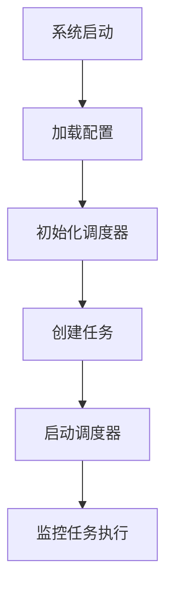
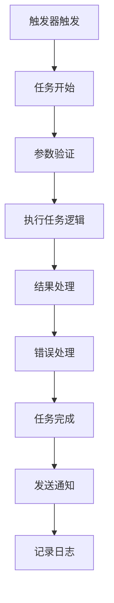

# 调度系统功能

## 📖 概述

调度系统是 Quote System 的核心组件之一，负责自动化执行各种定时任务。系统基于 APScheduler 构建，支持多种触发器和灵活的任务配置，能够自动完成数据更新、维护和监控等工作。

## 🎯 核心功能

### 1. 任务调度
- **定时执行**：支持 cron 表达式和间隔触发
- **任务管理**：动态添加、删除、修改任务
- **并发控制**：控制任务并发执行
- **错误处理**：任务失败重试和报警

### 2. 预定义任务
- **每日数据更新**：自动更新股票日线数据
- **系统健康检查**：检查数据源/数据库/资源状态，异常时告警
- **交易日历更新**：定期更新交易日历
- **数据维护**：每周数据备份和清理
- **月度缺口检查**：按范围检测并修复缺口
- **数据缺口检测与修复**：检测缺口并触发自动补齐
- **研究域股东维护**：每日公告驱动增量检查、周六 changed-only 周期复核，以及手工全量刷新入口
- **数据库备份**：定期备份数据库文件

### 2.1 生产错峰时间表

当前自动启用任务按业务域和写库压力错峰安排如下。轻量监控任务允许与其他任务重叠；长任务和同源研究域任务尽量保持独立窗口。

| 任务 | 业务类型 | 当前时间 | 运行窗口/说明 |
|---|---|---|---|
| `system_health_check` | 监控 | 每小时 | 轻量检查，允许与其他任务并行 |
| `trading_calendar_update` | 交易日历 | 每月 1 日 `01:00` | 月初轻量更新，早于月度修复 |
| `weekly_data_maintenance` | 周维护 | 周日 `02:00` | 预留 5 小时，避开周日白天修复 |
| `database_backup` | 备份 | 周六 `03:30` | 早于股东增量、申万和股东周期复核 |
| `shareholder_incremental_sync` | 股东增量 | 每日 `06:30` | 公告驱动，预留 1 小时，早于申万任务 |
| `cache_warm_up` | 缓存 | 每日 `08:00` | 轻量预热，早于研究域写库任务 |
| `industry_index_analysis_sync` | 申万指数指标 | 周一至周五 `10:45` | 与申万分类同源，后移到分类窗口之后 |
| `market_dependency_version_check` | 依赖检查 | 每日 `12:00` | 轻量网络检查 |
| `monthly_data_integrity_check` | 月度完整性 | 每月 2 日 `11:00` | 避开 1 日交易日历和周日凌晨维护高峰 |
| `shareholder_reconciliation_sync` | 股东周期复核 | 周六 `12:30` | 预留 5 小时，避开备份和申万任务 |
| `quarterly_cleanup` | 季度清理 | 季度最后一天 `14:30` | 避开凌晨维护/备份窗口 |
| `find_gap_and_repair` | 缺口修复 | 周日 `15:00` | 周维护完成后执行，预留 4 小时 |
| `hk_daily_data_update` | 港股行情 | 周一至周五 `17:30` | 港股收盘后执行，前置 HKEX 主数据 `lifecycle_write` 治理 |
| `industry_standard_sync` | 申万分类 | 每日 `19:15` | 收盘后强制刷新 A 股主数据，再维护申万分类/归属基础层 |
| `daily_data_update` | A 股行情 | 周一至周五 `20:00` | 强制刷新 A 股主数据，再读取 tradable universe 做行情日更 |

### 3. 任务监控
- **状态监控**：实时查看任务执行状态
- **执行日志**：详细的任务执行记录
- **性能统计**：任务执行时间和成功率统计

## 🏗️ 系统架构

### 核心组件
```
SchedulerCore
├── TaskManager      # 任务管理器
├── JobConfig        # 任务配置
├── Monitor          # 监控组件
└── ErrorHandler    # 错误处理器
```

### 数据流
```
配置文件 → 任务调度器 → 任务执行 → 结果反馈 → 通知系统
```

## 📋 预定义任务详解

### 1. 每日数据更新 (daily_data_update)

#### 功能描述
自动下载和更新当日股票和指数数据，确保数据的及时性。通过 `instrument_types` 参数控制更新的品种范围（默认读取配置文件）。

普通 A 股日更会先执行证券主数据同步：

- 范围为 `SSE`、`SZSE`、`BSE` 的 `stock` 主数据。
- A 股股票主数据源为 `exchange_official -> BaoStock -> AkShare`：上交所、深交所、北交所官方 current list 是股票生命周期最高证据；BaoStock 是第一备源，AkShare 是第二备源。官方源成功时，备源只补充非生命周期字段和差异诊断，不把官方列表缺失代码并集补入 active universe。
- 指数日线使用官方源优先：`SSE index = CSIndex -> BaoStock -> AkShare`，`SZSE index = CNIndex -> BaoStock -> AkShare`；官方源返回非空但未覆盖请求区间内最后一个交易日时继续 fallback。
- 日更走共享主数据前置治理，并默认命中 `force_refresh_job_names`；当前日更会跳过 freshness 复用并重新拉取上游主数据。`instrument_types` 包含 `index` 时，还会在读取指数 universe 前执行 A 股指数主数据治理。
- 同步完成后重新读取 active instruments，再开始行情抓取。
- 指数治理会把 CNIndex 没有有效 6 位 `深交所行情代码` 的官方指数保存为 metadata-only 主数据身份；本地遗留的错误行情型 key 或非 6 位 `.SZ` key 会被标记为 `status=metadata_only,is_active=0,trading_status=0`，因此不会进入 `tradable_only=True` 的普通日更抓取池。
- 普通日更允许主数据和行情源存在 T+1/T+2 滞后，但标的进入本地主表后会按 `data_config.daily_update_catchup` 自动执行小窗口追补：本地无行情的新股从 `max(listed_date, target_date - new_instrument_catchup_days)` 抓到目标日，短缺口从 `max(latest_quote_date, target_date - short_gap_catchup_days)` 抓到目标日。
- 追补窗口被截断、缺少上市日或追补样例会进入日更报告；超过窗口的大缺口继续由 `/backfill` 或 `find_gap_and_repair` 处理。
- 历史补数模式默认跳过当前主数据同步，并在报告数据中记录 skip reason；午夜后重跑前一交易日日更视为当前日更重试，仍会强制运行 A 股股票和指数主数据治理，更早日期才按历史回补跳过。
- 日更报告会包含 `instrument_master_sync` 和行情追补统计，用于暴露新增、停用、主数据新鲜度、`source_authority`、追补窗口和 warnings/errors。若官方源失败而由 BaoStock/AkShare 接管，报告会显示 fallback authority。
- 如需单独运行 A 股股票主数据治理，使用 manual-only 任务 `/run a_share_stock_master_sync`；该任务只刷新 `SSE/SZSE/BSE` 股票主数据，不下载日更行情，也不运行指数治理。

#### 配置示例
```json
{
  "daily_data_update": {
    "enabled": true,
    "description": "每日数据更新",
    "trigger": {
      "type": "cron",
      "hour": 20,
      "minute": 30,
      "second": 0
    },
    "max_instances": 1,
    "misfire_grace_time": 600,
    "coalesce": true,
    "parameters": {
      "exchanges": ["SSE", "SZSE"],
      "wait_for_market_close": true,
      "market_close_delay_minutes": 15,
      "enable_trading_day_check": true
    }
  }
}
```

#### 业务逻辑
1. **交易日检查**：检查当日是否为交易日
2. **市场等待**：等待市场收盘后开始更新
3. **数据下载**：下载当日所有股票数据
4. **质量验证**：验证数据完整性
5. **结果通知**：发送更新结果通知

#### 核心方法
```python
async def daily_data_update(self,
                            exchanges: List[str] = None,
                            wait_for_market_close: bool = True,
                            market_close_delay_minutes: int = 15,
                            enable_trading_day_check: bool = True,
                            instrument_types: List[str] = None):
    """每日数据更新任务
    
    instrument_types: 要更新的品种类型列表，如 ['stock', 'index']。
                     若不传则读取配置文件 instrument_types 项。
    """
```

### 2. 交易日历更新 (trading_calendar_update)

#### 功能描述
定期从数据源获取最新的交易日历信息，确保交易日的准确性。

#### 配置示例
```json
{
  "trading_calendar_update": {
    "enabled": true,
    "description": "交易日历更新",
    "trigger": {
      "type": "cron",
      "day": 1,
      "hour": 1,
      "minute": 0,
      "second": 0
    },
    "max_instances": 1,
    "misfire_grace_time": 1800,
    "coalesce": true,
    "parameters": {
      "exchanges": ["SSE", "SZSE"],
      "update_future_months": 6,
      "force_update": false,
      "validate_holidays": true
    }
  }
}
```

#### 业务逻辑
1. **数据源连接**：连接到数据源
2. **日期范围计算**：计算需要更新的日期范围
3. **交易日历获取**：从数据源获取交易日历
4. **数据验证**：验证交易日历的完整性
5. **数据库更新**：更新本地交易日历表

#### 核心方法
```python
async def trading_calendar_update(self,
                                exchanges: List[str] = None,
                                update_future_months: int = 6,
                                force_update: bool = False,
                                validate_holidays: bool = True):
    """交易日历更新任务"""
```

### 3. 每周数据维护 (weekly_data_maintenance)

#### 功能描述
执行定期的数据维护任务，包括备份、清理和优化。

#### 配置示例
```json
{
  "weekly_data_maintenance": {
    "enabled": true,
    "description": "每周数据维护",
    "trigger": {
      "type": "cron",
      "day_of_week": "sun",
      "hour": 2,
      "minute": 0,
      "second": 0
    },
    "max_instances": 1,
    "misfire_grace_time": 1800,
    "coalesce": true,
    "parameters": {
      "backup_database": true,
      "cleanup_old_logs": true,
      "log_retention_days": 30,
      "cleanup_ghost_stocks": false,
      "ghost_stock_grace_days": 14,
      "zombie_stock_grace_days": 30,
      "sync_adjustment_factors": true,
      "factor_sync_exchanges": ["SSE", "SZSE", "BSE", "HKEX"],
      "factor_sync_days_back": 7,
      "validate_data_integrity": true,
      "optimize_database": true,
      "max_runtime_seconds": 18000
    }
  }
}
```

#### 维护任务
1. **数据库备份**：自动备份数据库
2. **日志清理**：清理过期日志文件
3. **幽灵/僵尸标的清理**：已废弃并默认跳过。标的生命周期必须由 A 股/HKEX 等交易所专用主数据治理写入，周维护不再用“最后行情日期超过阈值”的通用规则直接停用主数据
4. **复权因子周度同步**：按 `factor_sync_exchanges` 和 `routing.factor.<exchange>.maintenance_sync_enabled` 执行周度因子同步；港股因子默认放在该阶段执行
5. **数据完整性检查**：验证维护写入后的最终数据一致性
6. **数据库优化**：在维护写入完成后执行 VACUUM 和 ANALYZE

#### 核心方法
```python
async def weekly_data_maintenance(self,
                                backup_database: bool = True,
                                cleanup_old_logs: bool = True,
                                log_retention_days: int = 30,
                                optimize_database: bool = True,
                                validate_data_integrity: bool = True,
                                cleanup_ghost_stocks: bool = False,
                                ghost_stock_grace_days: int = 14,
                                zombie_stock_grace_days: int = 30,
                                sync_adjustment_factors: bool = True,
                                factor_sync_exchanges: Optional[List[str]] = None,
                                factor_sync_days_back: int = 7):
    """每周数据维护任务"""
```

### 4. 月度数据完整性检查 (monthly_data_integrity_check)

#### 功能描述
每月执行数据完整性检查并修复缺口（可配置检查范围与过滤条件）。

#### 配置示例
```json
{
  "monthly_data_integrity_check": {
    "enabled": true,
    "description": "月度数据完整性检查和缺口修复",
    "trigger": {
      "type": "cron",
      "day": 1,
      "hour": 3,
      "minute": 0,
      "second": 0
    },
    "max_instances": 1,
    "misfire_grace_time": 3600,
    "coalesce": true,
    "parameters": {
      "exchanges": ["SSE", "SZSE"],
      "days_to_check": 45
    }
  }
}
```

### 5. 季度数据清理 (quarterly_cleanup)

#### 功能描述
每季度执行一次深度清理，删除过期数据。

#### 配置示例
```json
{
  "quarterly_cleanup": {
    "enabled": true,
    "description": "季度数据清理",
    "trigger": {
      "type": "cron",
      "month": "3,6,9,12",
      "day": "last",
      "hour": 4,
      "minute": 0,
      "second": 0
    },
    "max_instances": 1,
    "misfire_grace_time": 1800,
    "coalesce": true,
    "parameters": {
      "cleanup_old_quotes": true,
      "quote_retention_months": 36,
      "cleanup_temp_files": true,
      "cleanup_backup_files": false,
      "backup_retention_months": 12
    }
  }
}
```

### 6. 数据缺口检测与修复 (find_gap_and_repair)

#### 功能描述
定期检测交易品种的数据缺口，并根据配置参数触发自动修复。

#### 配置示例
```json
{
  "find_gap_and_repair": {
    "enabled": true,
    "description": "数据缺口检测与修复",
    "trigger": {
      "type": "cron",
      "day_of_week": "sun",
      "hour": 3,
      "minute": 30
    },
    "max_instances": 1,
    "misfire_grace_time": 1800,
    "coalesce": true,
    "parameters": {
      "exchanges": ["SSE", "SZSE", "BSE"],
      "start_date": "2024-01-01",
      "repair_universe_mode": "historical_backfill",
      "override_lifecycle_filter": false,
      "force_current_master_refresh": false
    }
  }
}
```

#### 业务逻辑
1. **生命周期过滤**：先用本地主数据治理状态过滤 repair universe；停编指数、退市后区间、stale-no-quote 指数、HKEX 长期停牌且请求区间晚于本地最新行情日的股票，以及 HKEX 缺少 `listed_date` 但已有本地首个行情日的新近 active 标的，会在源请求前跳过或裁剪。
2. **缺口检测**：仅对生命周期有效窗口按交易所与日期范围检测缺口。
3. **自动修复**：逐个缺口触发补齐；旧 gap 记录在 `_fill_single_gap()` 前还会重新校验生命周期，防止绕过过滤。
4. **执行记录**：报告检测数量、修复结果、失败跳表数量、HKEX guard 跳过数量，以及 `repair_universe` 生命周期跳过数量、原因分布和样例。

默认 `repair_universe_mode=historical_backfill` 只使用本地状态，不刷新 A 股当前主数据。周度 `find_gap_and_repair` 会在检测前仅对 `hkex_instrument` scope 执行 HKEX lifecycle 前置治理；需要其他运维取证时可显式设置 `force_current_master_refresh=true` 并用 `current_master_refresh_scopes` 限定 scope；需要绕过生命周期过滤时必须同时提供明确标的或小范围 `repair_universe_limit`，否则任务会在请求行情源前失败。

### 6.1 研究域申万标准行业缺口修复 (industry_standard_gap_fill)

#### 功能描述
对 strict Shenwan `authoritative membership` 覆盖率执行“先识别缺口，再定向补齐”的复合任务，用于收口 `industry_standard_ready` 前的剩余缺口，而不是每次都做全市场全量重跑。

#### 配置示例
```json
{
  "industry_standard_gap_fill": {
    "enabled": false,
    "description": "研究域申万标准行业缺口检测与定向修复",
    "trigger": {
      "type": "cron",
      "day_of_week": "sat",
      "hour": 9,
      "minute": 0,
      "second": 0
    },
    "max_instances": 1,
    "misfire_grace_time": 1800,
    "coalesce": true,
    "parameters": {
      "exchanges": ["SSE", "SZSE", "BSE"],
      "missing_limit_per_exchange": 200,
      "budget_mode": "availability_first",
      "allow_paid_proxy": true
    }
  }
}
```

#### 业务逻辑
1. **缺口枚举**：读取 strict Shenwan authoritative membership 覆盖率，按交易所列出缺失标的。
2. **定向补齐**：仅对缺口标的调用 `industry_standard_sync`，通过 `instrument_ids_by_exchange` 缩小同步范围。
3. **结果复核**：输出补齐前后 `missing_authoritative_membership_count` 与修复数量摘要。

### 6.2 研究域股东摘要手工全量刷新 (shareholder_shadow_sync)

#### 功能描述
手工全量刷新本地 `shareholder_snapshots`，覆盖股东户数、前十大股东和股权结构线索。当前股东域已完成全量导入并开放本地 API；常驻维护由每日增量和周期复核任务承担，全量刷新只作为 operator 显式补救入口。

`2026-05-23` 已新增 OpenSpec `add-shareholder-incremental-sync` 并落地通用 CNInfo 公告元数据扫描/过滤/水位模块。`shareholder_shadow_sync` 保留为手工全量刷新/修复任务，不再作为常驻周六定时任务；`shareholder_incremental_sync` 作为每日公告驱动的股东增量检查任务。增量任务的目标不是每天逐标的全量读取股东详情，而是按 CNInfo 市场/栏目和时间窗口扫描公告元数据，筛选候选标的后再做结构化股东数据 hash 比较。

`manual_only=true` 的任务仍保留在任务配置和 `/status` 中，但不会注册进 APScheduler 自动触发队列；状态展示为手工执行入口，可通过 `/run shareholder_shadow_sync` 执行。

#### 当前配置
```json
{
  "shareholder_shadow_sync": {
    "enabled": true,
    "manual_only": true,
    "description": "研究域股东摘要影子同步",
    "trigger": {
      "type": "cron",
      "day_of_week": "sat",
      "hour": 10,
      "minute": 0,
      "second": 0
    },
    "parameters": {
      "exchanges": ["SSE", "SZSE", "BSE"],
      "limit_per_exchange": null,
      "budget_mode": "availability_first",
      "allow_paid_proxy": true,
      "write_policy": "refresh_all",
      "max_runtime_seconds": 18000
    }
  }
}
```

#### 业务逻辑
1. **全量扫描**：按 `SSE / SZSE / BSE` 股票池运行，不设置单交易所数量上限。
2. **主链导入**：优先使用 `cninfo:direct` 官方结构化股东数据，`AkShare:proxy_patch / akshare:direct / efinance:direct` 仅作为定向 fallback。
3. **本地落库**：写入 `research.db` 的 `shareholder_snapshots`，API 读取不实时访问外部源。

### 6.3 股东信息更新任务对照

| 任务 | 触发方式 | 是否全量读取 | 是否全量写入 | 主要用途 |
|---|---|---:|---:|---|
| `shareholder_incremental_sync` | 每日 `06:30` 自动，也可 `/run` | 否，只读取公告候选、缺失或 pending 标的 | 否，只写变化、缺失或 required scope 不完整标的 | 日常及时更新，覆盖季报/年报/半年报和权益变动类公告 |
| `shareholder_reconciliation_sync` | 每周六 `12:30` 自动，也可 `/run` | 是，读取 `SSE / SZSE / BSE` 活跃股票 | 否，`changed_only`，本地 hash 和 required scope 相同则跳过 | 周期复核、补足历史缺口、捕捉 CNInfo data20 静默修正或公告漏识别 |
| `shareholder_shadow_sync` | 仅手工 `/run` | 是，读取 `SSE / SZSE / BSE` 活跃股票 | 是，`refresh_all` | 初始化、灾后修复、operator 明确要求的全量重写 |

三者共用股东 provider 路由和 required scope 定义。区别在于候选范围和写入策略：每日增量先用公告缩小候选；周期复核全量读取但只写差异；手工全量刷新全量读取并刷新写入。

### 6.4 研究域股东摘要周期复核与补足 (shareholder_reconciliation_sync)

#### 功能描述
每周六 `12:30` 对 `SSE / SZSE / BSE` 做全量读取和本地 hash 对比，只写入结构化内容变化、本地缺失或 required scope 覆盖不完整的标的。这个任务用于兜底 CNInfo data20 静默修正、历史快照缺口和增量公告漏识别；它不做无差别全量重写。

#### 变更判断
1. **全量读取目标股票池**：与全量刷新一样读取 `SSE / SZSE / BSE` 活跃股票。
2. **生成新快照**：按 `cninfo:direct -> akshare:proxy_patch -> akshare:direct -> efinance:direct` 的股东域路由合并快照。
3. **本地 hash 对比**：将新 `snapshot_json` 与本地 `shareholder_snapshots.snapshot_json` 做规范化 JSON hash 对比。
4. **required scope 检查**：本地快照必须覆盖 `holder_count / top10_holders / reference_only_ownership_clues`。
5. **只写必要变更**：hash 相同且 required scope 完整时跳过；hash 变化、本地缺失或 required scope 不完整时才写入 `shareholder_snapshots` 和 `raw_payload_audit`。

#### 当前配置
```json
{
  "shareholder_reconciliation_sync": {
    "enabled": true,
    "description": "研究域股东摘要周期复核与补足",
    "trigger": {"type": "cron", "day_of_week": "sat", "hour": 12, "minute": 30, "second": 0},
    "parameters": {
      "exchanges": ["SSE", "SZSE", "BSE"],
      "limit_per_exchange": null,
      "budget_mode": "availability_first",
      "allow_paid_proxy": true,
      "write_policy": "changed_only",
      "max_runtime_seconds": 18000
    }
  }
}
```

### 6.5 研究域股东摘要每日增量检查 (shareholder_incremental_sync)

#### 功能描述
每日按 CNInfo 公告元数据发现可能发生股东信息变化的候选标的，再对候选标的读取结构化股东数据并计算规范化 hash。只有 hash、报告期或 required scope 发生变化时才写入 `shareholder_snapshots` 和 `raw_payload_audit`；未变化的候选只更新 `shareholder_change_manifest`。

#### 当前配置
```json
{
  "shareholder_incremental_sync": {
    "enabled": true,
    "description": "研究域股东摘要每日增量检查",
    "trigger": {"type": "cron", "hour": 6, "minute": 30, "second": 0},
    "parameters": {
      "exchanges": ["SSE", "SZSE", "BSE"],
      "lookback_days": 7,
      "overlap_days": 2,
      "page_size": 30,
      "max_pages_per_market": 20,
      "max_candidates": 300,
      "pending_recheck_days": 5,
      "budget_mode": "availability_first",
      "allow_paid_proxy": true,
      "dry_run": false,
      "max_runtime_seconds": 3600
    }
  }
}
```

#### 业务逻辑
1. **公告扫描**：通用 CNInfo scanner 按市场/栏目和时间窗口分页扫描，不逐股票查询公告。
2. **候选筛选**：股东域过滤季度/年度/半年度报告、权益变动、控股股东/实控人变更等公告，并合并本地缺失 required scope 与 pending recheck 标的。
3. **变更判断**：对候选标的读取股东结构化数据，计算 `holder_count / top10_holders / ownership_clues` 规范化 hash。
4. **有变才写**：hash 未变化时不重写快照；公告早于结构化数据更新时进入 5 个自然日 pending recheck，用于吸收 CNInfo 公告元数据与 data20 结构化股东数据之间的更新滞后。
5. **pending 硬上限**：同一批公告第一次进入 pending 时记录 `first_pending_at`，截止时间固定为 `first_pending_at + pending_recheck_days`；同一公告不会因每日扫描而滚动延长。完成更新会转为 `changed` 并清空 pending，超过截止时间会转为普通 unchanged，不再从 pending 队列重试；新的公告 ID 会开启新的 pending 周期。
6. **健康复核**：运行后可通过 `/api/v1/research/shareholders/readiness` 或 `scripts/research_shareholder_rollout_validation.py --skip-sync` 复核 required scope 覆盖。

### 6.6 研究域财务报表日更与对账

#### 功能描述
财务报表不再依赖周六股东刷新窗口。L1 本地核心层完成初始化后，财务维护应拆成手工全量入口、公告驱动增量入口和周期对账入口，模式参考股东摘要更新，但写入目标为 `data/financials.db`。

- `financial_l1_full_import`：仅手工 `/run`，封装当前 L1 全量导入/补处理脚本，不注册 cron；用于初始化、灾后恢复和大范围补处理。
- `financial_disclosure_incremental_sync`：公告驱动日更，扫描 CNInfo 定期报告公告和披露异常公告，生成候选标的/报告期后定向补处理。
- `financial_disclosure_reconciliation_sync`：周度兜底，复核缺失报告期、accepted gap、pending recheck 和 CNInfo 静默更新。
- 旧 `financial_statements_catchup_sync / financial_statements_reconciliation_sync` 在新任务落地前保持禁用；后续应迁移到新的公告驱动语义或作为兼容别名。

实现状态（`2026-06-10`）：财务 L1 三项任务已写入 `config/05_scheduler.json`，并接入 `ScheduledTasks` 和 `DataManager`。全量任务为 `manual_only=true`，只通过 `/run` 手工触发；公告驱动增量任务已启用为每日 `21:45` 自动运行，避开港股日更和 A 股日更主窗口；周度对账任务已启用为周日 `09:30` 自动运行，二者仍可通过 `/run` 手工验证。公告筛选已收紧为正式定报、更正/修订、延期披露和定报相关停牌/退市风险公告；业绩说明会、英文版、图文版、问询函回复、专项说明、投资者接待日和摘要默认不产生候选。券商专项财务事实任务 `broker_risk_control_incremental_sync` 已接入调度管理，但配置为 `manual_only=true`，不会单独注册 cron；它由 `financial_disclosure_incremental_sync` 成功后作为后置任务自动触发，也可通过 `/run broker_risk_control_incremental_sync` 手工验证。

券商后置任务已迁移到配置驱动的任务依赖图：`financial_disclosure_incremental_sync` 成功后，调度器读取 `config/05_scheduler.json` 的 job-level `dependencies.post_success` 配置触发 `broker_risk_control_incremental_sync`，不再由财务日更任务函数内部硬编码执行。新架构开发文档为 `docs/development/scheduler_task_dependency_dag.md`，对应 OpenSpec change 为 `configure-scheduler-task-dependency-dag`。

#### 配置驱动任务依赖图

完整工程设计以 `docs/development/scheduler_task_dependency_dag.md` 为准。本节只保留调度功能文档中的使用口径。

调度器支持在 `config/05_scheduler.json` 中声明任务依赖关系，统一表达前置、后置、并行和串行编排：

```json
{
  "financial_disclosure_incremental_sync": {
    "dependencies": {
      "post_success": [
        {
          "mode": "parallel",
          "group_id": "financial_industry_supplements",
          "jobs": [
            {
              "job_id": "broker_risk_control_incremental_sync",
              "inherit": ["exchanges", "dry_run"],
              "timeout_seconds": 7200,
              "failure_policy": "degrade_parent"
            }
          ]
        }
      ]
    }
  },
  "broker_risk_control_incremental_sync": {
    "dependencies": {
      "post_success": [
        {
          "mode": "serial",
          "group_id": "future_chain",
          "jobs": [
            {
              "job_id": "future_special_industry_incremental_sync",
              "failure_policy": "stop_chain"
            }
          ]
        }
      ]
    }
  }
}
```

语义要求：

- `pre_success`：主任务运行前先执行，前置失败时按 `failure_policy` 决定跳过、降级或失败主任务。
- `post_success`：主任务成功或 degraded 后执行；用于财务日更后的行业专项补充层。
- `post_always`：主任务无论成功失败都执行，适合清理、报告、审计。
- `mode=parallel`：同一依赖组内并行执行，例如任务 B/C 同时后置于 A。
- `mode=serial`：按配置顺序串行执行，例如 C 后置于 B，B 后置于 A。
- `inherit`：声明从父任务继承的参数，避免在代码中隐式复制。
- `failure_policy`：至少支持 `fail_parent`、`degrade_parent`、`ignore`、`stop_chain`。
- 调度报告应展示依赖图每个节点的状态、耗时、写入数量、错误摘要和继承参数；父任务报告不得只显示主任务结果。
- `manual_only=true` 的任务可以作为依赖节点被自动编排触发，但不会单独注册 cron。

#### 当前配置
```json
{
  "financial_l1_full_import": {
    "enabled": true,
    "manual_only": true,
    "description": "财务 L1 本地核心层手工全量导入与补处理",
    "parameters": {
      "exchanges": ["SSE", "SZSE", "BSE"],
      "period_window": "latest",
      "rolling_quarters": 10,
      "baseline_report_period": "2024Q1",
      "db_path": "data/financials.db",
      "batch_size": 20,
      "max_runtime_seconds": 18000
    }
  },
  "financial_disclosure_incremental_sync": {
    "enabled": true,
    "trigger": {"type": "cron", "hour": 21, "minute": 45},
    "parameters": {
      "exchanges": ["SSE", "SZSE", "BSE"],
      "lookback_days": 14,
      "overlap_days": 3,
      "page_size": 30,
      "max_pages_per_market": 40,
      "pending_recheck_days": 7,
      "max_candidates": 500,
      "db_path": "data/financials.db",
      "dry_run": false,
      "max_runtime_seconds": 7200
    },
    "dependencies": {
      "post_success": [
        {
          "group_id": "financial_industry_supplements",
          "mode": "parallel",
          "jobs": [
            {
              "job_id": "broker_risk_control_incremental_sync",
              "inherit": ["exchanges", "dry_run"],
              "timeout_seconds": 7200,
              "failure_policy": "degrade_parent"
            }
          ]
        }
      ]
    }
  },
  "broker_risk_control_incremental_sync": {
    "enabled": true,
    "manual_only": true,
    "parameters": {
      "exchanges": ["SSE", "SZSE", "BSE"],
      "lookback_days": 14,
      "overlap_days": 3,
      "per_instrument_max_pages": 2,
      "limit_instruments": 0,
      "dry_run": false,
      "scan_only": false,
      "max_runtime_seconds": 7200
    }
  },
  "financial_disclosure_reconciliation_sync": {
    "enabled": true,
    "trigger": {"type": "cron", "day_of_week": "sun", "hour": 9, "minute": 30},
    "parameters": {
      "exchanges": ["SSE", "SZSE", "BSE"],
      "period_window": "latest",
      "rolling_quarters": 10,
      "max_candidates": 500,
      "pending_recheck_days": 7,
      "db_path": "data/financials.db",
      "max_runtime_seconds": 10800
    }
  },
  "financial_statements_catchup_sync": {
    "enabled": false,
    "trigger": {"type": "cron", "day_of_week": "mon-fri", "hour": 17, "minute": 45},
    "parameters": {
      "exchanges": ["SSE", "SZSE", "BSE"],
      "sync_mode": "catchup",
      "force_full": false,
      "max_runtime_seconds": 7200
    }
  },
  "financial_statements_reconciliation_sync": {
    "enabled": false,
    "trigger": {"type": "cron", "day_of_week": "sun", "hour": 8, "minute": 30},
    "parameters": {
      "exchanges": ["SSE", "SZSE", "BSE"],
      "sync_mode": "catchup",
      "force_full": true,
      "max_runtime_seconds": 10800
    }
  }
}
```

#### 业务逻辑
1. **主数据前置**：三个财务任务在读取 active 股票池前都先走共享证券主数据治理，历史回补语义除外。
2. **公告候选**：增量任务按 CNInfo 市场/栏目和时间窗口扫描公告，不逐股票扫描；只筛选正式年度报告、半年度报告、一季报、三季报主公告及其更正/修订、延期披露、停牌、退市风险警示和可能终止上市公告。业绩说明会、英文版、图文版、问询函/回复、专项说明、投资者接待日和摘要类公告默认过滤。
   历史 `pending_recheck` 在再次进入候选前也会重新套用当前筛选规则，旧逻辑留下的说明会、英文版、图文版、问询函专项说明等噪声计入 `filtered_stale_pending`，不再触发补数。
3. **披露异常标记**：历史缺报且公告显示无法按期披露、停牌、退市风险或可能终止上市时，先标记为 `accepted_disclosure_gap` 或 `pending_delisting_risk`，并记录公告证据；该状态解释披露异常，不替代字段映射，也不触发每日补数重试。
4. **定向补处理**：只对公告候选、pending recheck、本地缺失报告期和 required core facts 不完整标的调用补数流程；已完整落库的 instrument-period 跳过。补数前会先套用股票生命周期，报告期早于上市日的本地缺口或历史 pending 直接记录为 `accepted_disclosure_gap/pre_listing_period`，不进入 CNInfo/THS/Sina 路由。
5. **字段口径与补数源路由**：L1 required facts 使用 `revenue / net_income_parent / equity_parent / total_assets / total_liabilities`，保持归母与合计口径分离。增量和周度对账维护任务按 `CNInfo data20 -> THS -> Sina` 执行。CNInfo data20 是官方结构化优先源；THS/Sina 只对 CNInfo 缺失、失败或语义不明确的 canonical facts 做字段级补齐。源顺序、CNInfo-first 修复、fallback 和 readiness 合并由 `FinancialMaintenanceRepairRouter` 统一处理，调度任务不直接写各数据源调用逻辑。
   Telegram 报告中的 `CNInfo ready` 是最终 canonical readiness 成功数；`CNInfo 批处理通过` 是 CNInfo 批处理层面的 instrument-period 通过数，二者必须分开解读。
6. **结构化数据滞后**：公告先到但 CNInfo data20 与 Sina/THS 结构化源均未更新时，候选进入 `pending_recheck`；同一公告的重查截止时间固定为首次 pending 派生值，不滚动延长。
7. **对账修复**：周度任务复核报告期覆盖、核心事实、source manifest、parser diagnostics、fallback 占比、accepted gap 和 hot/cold tier consistency。`outside_approved_local_core / mapping_catalog_empty` 会归为 `mapping_policy_gap`，不再调用补数源；`missing_local_core_fact` 等才归为 source missing 并进入补数路由。候选超过上限时按交易所、profile 和报告期均衡抽样。
8. **readiness gate**：运行后通过 `/api/v1/research/financial-statements/readiness` 与 `/api/v1/research/valuation/readiness` 判断是否允许 valuation rollout。
9. **状态持久化**：财务公告候选和处理结果写入 `financial_disclosure_event_state`，扫描水位和公告证据使用独立 purpose key 写入 CNInfo announcement 状态/审计表。

### 7. 系统健康检查 (system_health_check)

#### 功能描述
定期检查系统健康状态，包括数据源、数据库、磁盘与内存使用情况。

#### 说明
- 当检测到 `baostock_a_stock` 异常时，会尝试自动重连修复
- 修复结果会通过 Telegram 通知，并写入健康检查报告

### 8. 数据库备份 (database_backup)

#### 功能描述
按计划自动备份数据库文件，支持保留策略与通知。

#### 存储前提
- `data/` 是 Quote 本地数据卷挂载点，生产环境应由 `/dev/sda3` 挂载到
  `/home/python/Quote/data`。
- `data/PVE-Bak` 和 `data/QuoteBak` 是 NAS 子挂载点。备份任务写入
  `data/PVE-Bak/QuoteBak` 前，应确认该路径不是本地空目录。
- 如果 NAS 不可用，`nofail` 配置应允许本地数据卷和核心服务继续启动；
  备份任务需要失败告警，而不是把完整数据库备份落到本地数据卷。

### 9. 缓存预热 (cache_warm_up)

#### 功能描述
在非交易时间预热缓存，提高系统响应速度。

#### 配置示例
```json
{
  "cache_warm_up": {
    "enabled": true,
    "description": "缓存预热",
    "trigger": {
      "type": "cron",
      "day_of_week": "mon-fri",
      "hour": 8,
      "minute": 30
    },
    "max_instances": 1,
    "parameters": {
      "warm_popular_stocks": true,
      "popular_stocks_count": 100,
      "preload_recent_data": true,
      "recent_data_days": 30,
      "warm_market_indices": true
    }
  }
}
```

## 🎛️ 任务配置详解

### 触发器类型

#### 1. Cron 触发器
使用 cron 表达式定义执行时间。

```python
# 每天上午9点30分
{
  "type": "cron",
  "hour": 9,
  "minute": 30
}

# 每周一到周五下午3点
{
  "type": "cron",
  "day_of_week": "mon-fri",
  "hour": 15,
  "minute": 0
}

# 每月1号凌晨1点
{
  "type": "cron",
  "day": 1,
  "hour": 1,
  "minute": 0
}
```

#### 2. 间隔触发器
按固定间隔执行任务。

```python
# 每30分钟执行一次
{
  "type": "interval",
  "minutes": 30
}

# 每2小时执行一次
{
  "type": "interval",
  "hours": 2
}

# 每1天执行一次
{
  "type": "interval",
  "days": 1
}
```

#### 3. 日期触发器
在指定时间执行一次。

```python
# 在指定日期时间执行
{
  "type": "date",
  "run_date": "2024-12-31T23:59:59"
}
```

### 任务控制参数

| 参数 | 类型 | 默认值 | 说明 |
|------|------|--------|------|
| `max_instances` | integer | 1 | 任务最大并发实例数 |
| `misfire_grace_time` | integer | 300 | 错失任务的宽限时间（秒） |
| `coalesce` | boolean | true | 是否合并错失的任务 |
| `timezone` | string | Asia/Shanghai | 时区设置 |

## 🔧 核心类和方法

### Scheduler 类

```python
class QuoteScheduler:
    """调度器核心类"""

    def __init__(self):
        self.scheduler = AsyncIOScheduler()
        self.job_manager = JobManager()
        self.monitor = SchedulerMonitor()

    async def start(self):
        """启动调度器"""
        await self._load_jobs()
        self.scheduler.start()

    async def stop(self):
        """停止调度器"""
        self.scheduler.shutdown(wait=True)

    async def add_job(self, func, trigger, **kwargs):
        """添加任务"""
        job = self.scheduler.add_job(func, trigger, **kwargs)
        return job

    async def remove_job(self, job_id: str):
        """移除任务"""
        self.scheduler.remove_job(job_id)
```

### JobManager 类

```python
class JobManager:
    """任务管理器"""

    async def load_jobs_from_config(self):
        """从配置文件加载任务"""

    async def save_job_to_config(self, job_id: str, job_config: dict):
        """保存任务配置"""

    async def get_job_status(self, job_id: str):
        """获取任务状态"""

    async def pause_job(self, job_id: str):
        """暂停任务"""

    async def resume_job(self, job_id: str):
        """恢复任务"""
```

### SchedulerMonitor 类

```python
class SchedulerMonitor:
    """调度器监控"""

    async def get_scheduler_status(self):
        """获取调度器状态"""

    async def get_job_executions(self, job_id: str, limit: int = 100):
        """获取任务执行记录"""

    async def get_job_statistics(self, job_id: str):
        """获取任务统计信息"""

    async def check_job_health(self, job_id: str):
        """检查任务健康状态"""
```

## 📊 任务执行流程

### 任务启动流程

```mermaid
graph TD
    A[系统启动] --> B[加载配置]
    B --> C[初始化调度器]
    C --> D[创建任务]
    D --> E[启动调度器]
    E --> F[监控任务执行]
```

### 任务执行流程

```mermaid
graph TD
    A[触发器触发] --> B[任务开始]
    B --> C[参数验证]
    C --> D[执行任务逻辑]
    D --> E[结果处理]
    E --> F[错误处理]
    F --> G[任务完成]
    G --> H[发送通知]
    H --> I[记录日志]
```

## 🔍 监控和日志

### 任务状态监控
```python
async def get_all_jobs_status():
    """获取所有任务状态"""
    jobs = []
    for job in scheduler.get_jobs():
        status = {
            'id': job.id,
            'name': job.name,
            'next_run_time': job.next_run_time,
            'trigger': str(job.trigger),
            'max_instances': job.max_instances
        }
        jobs.append(status)
    return jobs
```

### 执行日志记录
```python
@log_execution("Scheduler", "daily_data_update")
async def daily_data_update(self, **kwargs):
    """带日志记录的任务执行"""
    pass
```

### 性能统计
```python
class JobStatistics:
    """任务统计"""

    def __init__(self):
        self.total_executions = 0
        self.successful_executions = 0
        self.failed_executions = 0
        self.average_execution_time = 0
        self.last_execution_time = None

    def record_execution(self, success: bool, duration: float):
        """记录任务执行"""
        self.total_executions += 1
        if success:
            self.successful_executions += 1
        else:
            self.failed_executions += 1

        # 更新平均执行时间
        self.average_execution_time = (
            (self.average_execution_time * (self.total_executions - 1) + duration)
            / self.total_executions
        )
```

## 🚨 错误处理和恢复

### 错误处理策略
1. **重试机制**：自动重试失败的任务
2. **降级处理**：主任务失败时执行备用方案
3. **错误报警**：发送错误通知
4. **任务暂停**：连续失败时暂停任务

### 重试配置
```json
{
  "retry_config": {
    "max_retries": 3,
    "retry_delay": 60,
    "exponential_backoff": true,
    "retry_on_exceptions": ["ConnectionError", "TimeoutError"]
  }
}
```

### 错误日志示例
```json
{
  "timestamp": "2024-10-11T20:30:00Z",
  "job_id": "daily_data_update",
  "error_type": "ConnectionError",
  "error_message": "Failed to connect to data source",
  "retry_count": 1,
  "next_retry": "2024-10-11T20:31:00Z"
}
```

## 🔧 命令行工具

### 启动调度器
```bash
python main.py scheduler
```

### 查看任务状态
```bash
python main.py status
```

### 手动执行任务
```bash
python main.py job --job-id daily_data_update
```

### 调度器管理
```bash
# 列出所有任务
python -c "from scheduler.scheduler import task_scheduler; import asyncio; asyncio.run(task_scheduler.list_jobs())"

# 暂停任务
python -c "from scheduler.scheduler import task_scheduler; import asyncio; asyncio.run(task_scheduler.pause_job('daily_data_update'))"

# 恢复任务
python -c "from scheduler.scheduler import task_scheduler; import asyncio; asyncio.run(task_scheduler.resume_job('daily_data_update'))"
```

## 📝 最佳实践

### 1. 任务配置建议
- 避免任务执行时间重叠
- 设置合理的 misfire_grace_time
- 使用 coalesce 合并重复任务
- 设置适当的 max_instances

### 2. 性能优化
- 在非交易时间执行重量级任务
- 合理设置批次大小
- 使用缓存减少重复计算
- 监控任务执行时间

### 3. 错误处理
- 设置合理的重试次数
- 实现降级机制
- 配置错误通知
- 定期检查任务健康状态

### 4. 日志管理
- 记录详细的执行日志
- 设置合理的日志级别
- 定期清理过期日志
- 使用结构化日志格式

## 🔄 版本更新

### v2.4.3 (2026-04-17)
- 🗓️ `weekly_data_maintenance` 新增 `sync_adjustment_factors`、`factor_sync_exchanges`、`factor_sync_days_back` 参数
- 🌐 港股复权因子默认纳入周维护同步，日更继续保持关闭
- 🧱 周维护顺序调整为“前置备份 -> 清理 -> 因子同步 -> 校验 -> 优化”，数据库优化移到所有写入动作之后
- ⏱️ 周维护超时预算上调到 `18000` 秒，覆盖港股因子扫描窗口
- 🛑 周维护不再执行通用 ghost/zombie 主数据停用；生命周期状态统一交由交易所主数据治理判定

### v2.4.2 (2026-04-09)
- ✨ 调度器 `weekly_data_maintenance` 任务新增死股/仙股智能封禁模块，优化庞大数据集运行效率
- 🛡️ 安全化自动参数：添加 `cleanup_ghost_stocks` 和 `ghost_stock_grace_days`（宽限期）

### v2.1.0 (2025-10-11)
- ✨ 新增交易日历智能选择策略
- 🔧 优化任务执行逻辑
- 📊 增强监控和统计功能

### v2.0.0 (2024-10-10)
- 🎉 重构调度器架构
- 📈 添加任务监控功能
- 🛡️ 增强错误处理机制

## 📞 技术支持

如果调度系统遇到问题：
1. 检查任务配置是否正确
2. 查看任务日志 `log/task.log`
3. 验证系统时间和时区设置
4. 检查任务依赖的服务状态
5. 提交问题反馈
